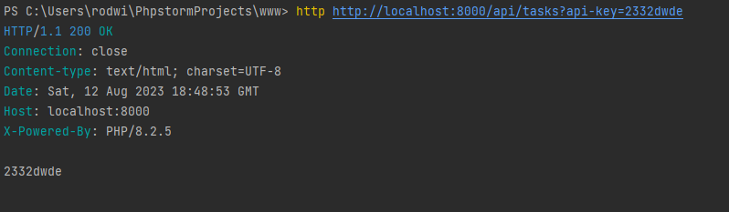
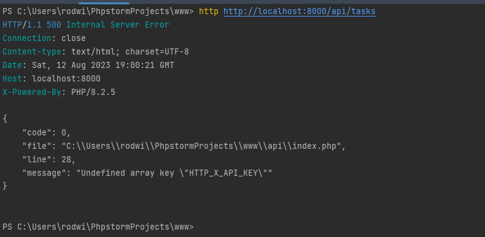

_# Create a RESTful API: build a framework for serving the API

## Start writing the API: enable URL rewriting

We are using the Apache webserver to create our API, but other webservers can also be used.

When running the project inside the Apache server, the URL show the name of the folder, as
well as the script, e.g. `https://localhost/api/index.php`. However, in our RESTful API we want URLs
like `../api/tasks` and/or `../api/tasks/123`.

By default, there is a direct mapping between the request URL and the file and folder on the webserver. So these RESTful URLs, which don't follow this pattern, won't work, as the webserver does not know what to do with them.

We can change this by using the URL rewriting capability of the webserver.

By adding some rewrite rules to the webserver config, we can associate each URL with whatever script we want.
In Apache, we can do this with a `.htaccess` file.

```apacheconf
RewriteEngine On

# Deactivate the URL rewriting for any exisiting file,
# directory or symbolic link.
RewriteCond %{REQUEST_FILENAME} !-f
RewriteCond %{REQUEST_FILENAME} !-d
RewriteCond %{REQUEST_FILENAME} !-l

# For any URL, run the inde.php script.
# The [L] flag tells the rewrite engine to stop processing.
RewriteRule . index.php [L]
```

Now in the browser we can specify whatever URL we like, and it will always run the `index.php` script.

## The front controller: get the resource, ID and the request method

A resource in a RESTful API has 2 URLs, one for a collection, e.g. `/products` and one for an individual resource, e.g. `/products/123`. We also decide what action to take based on the request method, e.g. `GET, POST PUT PATCH` or `DELETE`.

```php
<?php

// Now we are rewriting all URLs to go through this one script. This is
// known as a front controller. This means that all requests are sent through
// one single script and this script decides what to do.

// Parses the URL and removes the query string.
$path =  parse_url($_SERVER['REQUEST_URI'], PHP_URL_PATH);

// Splits the resource and id from the part
$parts = explode("/", $path);

// The resource is the 3rd part of the array, e.g. `/tasks`
$resource = $parts[2];

// The id is the 4th element of the array.
// If the id is not set we set it to null.
$id = $parts[3] ?? null;

echo $resource, ", ", $id;

// Get the request method
echo $_SERVER['REQUEST_METHOD'];
```

### Use a client for API development: cURL, Postman or HTTPie

Using the browser to test our API only allows us to make `GET` requests. We could use an HTML form to test the `POST` request method, and use Ajax to test other methods. This would effectively be writing a client for working with an API. There are already several of these available though.

#### cURL

We've been using cURL to access various APIs. Curl is also available from the command line and comes installed on most operating systems.

To make a `GET` request in cURL, run: `curl http://localhost:8000/api/tasks` as GET is the default.

To make a different request we add the `-X` or the `--request` flag: curl http://localhost:8000/api/tasks -X PATCH

#### Postman

If you prefer a graphical user interface you can use Postman, which can be run as a standalone application or in the browser.

#### HTTPie

HTTPie is a command-line tool like cURL but is built with API-development in mind. HTTPie is also more user-friendly than cURL.

To make a `GET` request in HTTPie, run: `http http://localhost:8000/api/tasks` as GET is the default.

To make a different request we simply include it before the URL: `http patch http://localhost:8000/api/tasks`

### Set the HTTP status code: best practices

At the moment we're not checking the path of the URL so every request will be successful. But for the purpose of our API we only want two URLs to be valid, `/tasks` and `/tasks/:id`. Any other URL should return a 404 status code.

```php
<?php

$path =  parse_url($_SERVER['REQUEST_URI'], PHP_URL_PATH);

$parts = explode("/", $path);

$resource = $parts[2];

$id = $parts[3] ?? null;

echo $resource, ", ", $id;

echo $_SERVER['REQUEST_METHOD'];

// The resource will always be `/tasks` in our API.
if ($resource != "tasks") {
    // Sets the reason-phrase automatically
    http_response_code(404);
    exit;
}
```
If you want to change the reason-phrase you will need to replace `http_response_code` with 
```php
header("{$_SERVER['SERVER_PROTOCOL']} 404 Your Reason Phrase");
```
In HTTP2 this is not supported.

### Add a controller class to decide the response

We will add a new directory, `src/TaskController` to decide responses.

```php
<?php

// Matching the classname to the filename is important for
// autoloading.

class TaskController
{
    public function processRequest($method, $id)
    {
        // If the id is null, the url will be for a collection, e.g. /tasks
        if ($id === null) {
            if ($method == "GET") {
                echo "index";
            } elseif ($method == "POST") {
                echo "create";
            }
        } else {
            // If the id is not null, we are dealing with an existing task, e.g. /tasks/123
            switch ($method) {
                case "GET":
                    echo "show $id";
                    break;

                case "PATCH":
                    echo "update $id";
                    break;

                case "DELETE":
                    echo "delete $id";
                    break;
            }
        }
    }
} 
```

### Use Composer's autoloader to load classes automatically

In the front controller, we explicitly load the file where the `TaskController` class is defined using this `require` statement:

```php
require dirname(__DIR__) . "/src/TaskController.php";
```

When adding more files and classes it would be simpler to load these automatically. We could do this by registering an autoloader using the `spl_autoload_register` function, but it is simpler to use composer's autoloader.

First we need to create a `composer.json` file in the root directory and add the following:

```json
{
  "autoload": {
    "psr-4": {
      "": "src/"
    }
  }
}
```

This means that the autoloader will try and load classes from the `src` folder. PSR-4 autoloading simply means that classes are loaded automatically when the filename matches the classname.

To generate the autoload script we run the `composer dump-autoload` command in the terminal, in the same directory as the `composer.json` file. This generates an `autoload.php` script inside the `vendor` folder.

Now we just need to require once and all subsequent classes will be automatically loaded, e.g.

```php
<?php

require dirname(__DIR__) . "/vendor/autoload.php";

$path =  parse_url($_SERVER['REQUEST_URI'], PHP_URL_PATH);

$parts = explode("/", $path);

$resource = $parts[2];

$id = $parts[3] ?? null;

if ($resource != "tasks") {
    http_response_code(404);
    exit;
}

$controller = new TaskController;

$controller->processRequest($_SERVER['REQUEST_METHOD'], $id);
```

### Make debugging easier: add type declarations and enable strict type checking

In the `TaskController` class we have the `processRequest` method which takes two arguments, a request method and a resource id.

To help with debugging we will add type declarations of `string` to both arguments and set its return value to `void` as it does not return anything.

We also need to make the `string $id` argument nullable by placing an `?` in front of the type declaration, else php will throw an error as it is only expecting a string value.

```php
<?php

class TaskController
{
    public function processRequest(string $method, ?string $id): void
    {
        // If the id is null, the url will be for a collection, e.g. /tasks
        if ($id === null) {
            if ($method == "GET") {
                echo "index";
            } elseif ($method == "POST") {
                echo "create";
            }
        } else {
            switch ($method) {
                case "GET":
                    echo "show $id";
                    break;

                case "PATCH":
                    echo "update $id";
                    break;

                case "DELETE":
                    echo "delete $id";
                    break;
            }
        }
    }
}
```

In the front controller (`index.php`) we will enable strict type checking setting the `strict_types` declaration to `1`. This has to be the first statement in the script. As all requests are going through the front controller this setting will be applied globally.

```php
<?php

declare(strict_types=1);

require dirname(__DIR__) . "/vendor/autoload.php";

$path =  parse_url($_SERVER['REQUEST_URI'], PHP_URL_PATH);

$parts = explode("/", $path);

$resource = $parts[2];

$id = $parts[3] ?? null;

if ($resource != "tasks") {
    http_response_code(404);
    exit;
}

$controller = new TaskController;

$controller->processRequest($_SERVER['REQUEST_METHOD'], $id);
```

### Always return JSON: add a generic exception handler and JSON Content-Type header

By default, PHP errors are formatted with HTML as it is assumed that it will be viewed in a browser. As this is an API this isn't the case. We will be accessing the API with code or a tool like HTTPie. We will return successful responses as well as errors as JSON as this is the de facto standard.

We can define a generic exception handler using the `set_exception_handler` function. This will catch all unhandled exceptions and allow us to control the output.

In the `src` folder we will create a new class called `ErrorHandler.php`.

```php
<?php

class ErrorHandler
{

    // The Throwable class is the base interface for all errors and exceptions thrown in PHP,
    // so we have access to various methods to get details about the error.
    public static function handleException(Throwable $exception): void
    {
        // Add generic server error
        http_response_code(500);

        echo json_encode([
            "code" => $exception->getCode(),
            "message" => $exception->getMessage(),
            "file" => $exception->getFile(),
            "line" => $exception->getLine()
        ]);
    }
}
```

Inside the front controller we know enable our error handler and set our content-type to JSON globally.

```php
<?php

declare(strict_types=1);

require dirname(__DIR__) . "/vendor/autoload.php";

// To enable the error handler
set_exception_handler("ErrorHandler::handleException");

$path =  parse_url($_SERVER['REQUEST_URI'], PHP_URL_PATH);

$parts = explode("/", $path);

$resource = $parts[2];

$id = $parts[3] ?? null;

if ($resource != "tasks") {
    http_response_code(404);
    exit;
}

// All response bodies in our API will be formatted as JSON, so we can safely put it inside
// the front controller.
header("Content-Type: application/json; charset=UTF-8");

$controller = new TaskController;

$controller->processRequest($_SERVER['REQUEST_METHOD'], $id);
```

Note, we probably should not output all the details as given in a production environment, but rather log it and output a generic error message.

### Send a 405 status code and Allow header for invalid request methods

In the task controller we output a response based on the request method and whether the URL contains an id or not. Some actions will be different for the same URL but with a different method. If we use a wrong request method we should output a 405 (Method Not Allowed) status code. When we send this status code we should also send a Allow header that lists the methods that are allowed on the resource.

```php
<?php

class TaskController
{
    public function processRequest(string $method, ?string $id): void
    {
        // If the id is null, the url will be for a collection, e.g. /tasks
        if ($id === null) {
            if ($method == "GET") {
                echo "index";
            } elseif ($method == "POST") {
                echo "create";
            } else {
                $this->respondMethodNotAllowed("GET, POST");
            }
        } else {
            switch ($method) {
                case "GET":
                    echo "show $id";
                    break;

                case "PATCH":
                    echo "update $id";
                    break;

                case "DELETE":
                    echo "delete $id";
                    break;

                default:
                    $this->respondMethodNotAllowed("GET, PATCH, DELETE");
            }
        }
    }

    private function respondMethodNotAllowed(string $allowed_methods): void
    {

        http_response_code(405);
        header("Allow: $allowed_methods");

    }
}
```

# Create a database and retrieve data from it

## Create a new database and a database user to access it

We have the basic framework for our API application. Instead of outputting placeholder messages from the `TaskController` we can manipulate data inside a database using the API.

Create a database from the terminal or use your GUI of choice, e.g. PHPMyAdmin or MySQLWorkbench.

Connect to the DB using the root account:

```sql
mysql -uroot -p
```

Create a new database called `api_db` or any name of your choosing:

```sql
CREATE DATABASE api_db;
```

Create a user for accessing this database, so we don't have to use the root account:

```sql
GRANT ALL PRIVILEGES ON api_db.* TO api_db_user@localhost IDENTIFIED BY 'k334fekfjhfjr4';
```

This user will have full privilege on all the tables in the new database. The random password will be used to connect to the database later on.

To check that this works we need to exit from the console:

```sql
exit;
```

Let's connect using the user and password we just created:

```sql
mysql uapi_db_user -p
```

Select the database:

```sql
use api_db;
```

## Create a table and store resource data

Now let's add a table to the `api_db` database to store tasks:

```sql
CREATE TABLE task (id INT NOT NULL AUTO_INCREMENT, name VARCHAR(128) NOT NULL, priority INT DEFAULT NULL, is_completed BOOLEAN NOT NULL DEFAULT FALSE, PRIMARY KEY (id), INDEX (name) );
```

To have a look at the table we just created:

```sql
DESCRIBE task;
```

## Connect to the database from PHP: add a Database class

Now that the database is set up we can connect to it using PHP.

Create a file inside the `src` folder and name it `Database.php`.

```php
<?php

class Database
{
    public function __construct(
        private string $host,
        private string $name,
        private string $user,
        private string $password
    ) {

    }

    public function getConnection(): PDO
    {
        $dsn = "mysql:host={$this->host};dbname={$this->name};charset=utf8";

        return new PDO($dsn, $this->user, $this->password, [
           PDO::ATTR_ERRMODE => PDO::ERRMODE_EXCEPTION
        ]);
    }
}
```

In the front-controller (`index.php`) we need to create a new object of the `Database` class.

```php
<?php

declare(strict_types=1);

require dirname(__DIR__) . "/vendor/autoload.php";

// To enable the error handler
set_exception_handler("ErrorHandler::handleException");

$path =  parse_url($_SERVER['REQUEST_URI'], PHP_URL_PATH);

$parts = explode("/", $path);

$resource = $parts[2];

$id = $parts[3] ?? null;

if ($resource != "tasks") {
    http_response_code(404);
    exit;
}

// All response bodies in our API will be formatted as JSON, so we can safely put it inside
// the front controller.
header("Content-Type: application/json; charset=UTF-8");

$database = new Database("localhost", "api_db", "root", "RohanNoah21#");
$database->getConnection();

$controller = new TaskController;

$controller->processRequest($_SERVER['REQUEST_METHOD'], $id);
```

If we have an error in our DB connection, here are some examples of the output from different API clients:

### Postman


### HTTPie


Fixing the password will resolve the issue.

## Move the database connection data to a separate .env file

Having the database object with the connection credentials hardcoded in the front-controller is not a good idea. If we check the file into source control our credentials will be exposed, and to change them would mean having to edit the front-controller file.

We will put this data into a separate file using a composer package called `vlucas/phpdotenv`.

Inside the root folder run:

```
composer require vlucas/phpdotenv
```

Next we create a separate `.env` file to store these values, inside the root folder.

```
DB_HOST="localhost"
DB_NAME="api_db"
DB_USER="root"
DB_PASS="RohanNoah21#"
```

Inside the `index.php` file we will now load the `.env` file and replace our credentials.

```php
<?php

declare(strict_types=1);

require dirname(__DIR__) . "/vendor/autoload.php";

set_exception_handler("ErrorHandler::handleException");

// We call the `createImmutable` method of the `Dotenv` class in the `Dotenv` namespace.
// Because we are already using composer's autoloader so the package's classes will be loaded automatically
$dotenv = \Dotenv\Dotenv::createImmutable(dirname(__DIR__));

// Load the values from the .env file into the PHPEnv superglobal
$dotenv->load();

$path =  parse_url($_SERVER['REQUEST_URI'], PHP_URL_PATH);

$parts = explode("/", $path);

$resource = $parts[2];

$id = $parts[3] ?? null;

if ($resource != "tasks") {
    http_response_code(404);
    exit;
}

header("Content-Type: application/json; charset=UTF-8");

$database = new Database($_ENV["DB_HOST"], $_ENV["DB_NAME"], $_ENV["DB_USER"], $_ENV["DB_PASS"]);

$controller = new TaskController;

$controller->processRequest($_SERVER['REQUEST_METHOD'], $id);
```

## Create a table data gateway class for the resource table

In the `TaskController` class at the moment we are outputting placeholder messages for each API action. Instead of working with the database directly inside this class we will create a separate class to access the task table following the Table Data Gateway pattern, an object that will act as a gateway to the task table.

Inside `src/TaskGateway.php`:

```php
<?php

class TaskGateway
{
    private PDO $conn;

    // Instead of creating an object of the database class we will inject the dependency by passing in an
    // object inside the constructor.
    public function __construct(Database $database)
    {
        $this->conn = $database->getConnection();
    }
}
```

Inside of `index.php`:

```php
<?php

declare(strict_types=1);

require dirname(__DIR__) . "/vendor/autoload.php";

set_exception_handler("ErrorHandler::handleException");

$dotenv = \Dotenv\Dotenv::createImmutable(dirname(__DIR__));

$dotenv->load();

$path =  parse_url($_SERVER['REQUEST_URI'], PHP_URL_PATH);

$parts = explode("/", $path);

$resource = $parts[2];

$id = $parts[3] ?? null;

if ($resource != "tasks") {
    http_response_code(404);
    exit;
}

header("Content-Type: application/json; charset=UTF-8");

$database = new Database($_ENV["DB_HOST"], $_ENV["DB_NAME"], $_ENV["DB_USER"], $_ENV["DB_PASS"]);

// When we create an object of the controller class we need to pass in an object of the
// `TaskGateway` class.
$task_gateway = new TaskGateway($database);

$controller = new TaskController($task_gateway);

$controller->processRequest($_SERVER['REQUEST_METHOD'], $id);
```

And `TaskController.php`

```php
<?php

class TaskController
{
    public function __construct(private TaskGateway $gateway)
    {
    }

    public function processRequest(string $method, ?string $id): void
    {
        // If the id is null, the url will be for a collection, e.g. /tasks
        if ($id === null) {
            if ($method == "GET") {
                echo "index";
            } elseif ($method == "POST") {
                echo "create";
            } else {
                $this->respondMethodNotAllowed("GET, POST");
            }
        } else {
            switch ($method) {
                case "GET":
                    echo "show $id";
                    break;

                case "PATCH":
                    echo "update $id";
                    break;

                case "DELETE":
                    echo "delete $id";
                    break;

                default:
                    $this->respondMethodNotAllowed("GET, PATCH, DELETE");
            }
        }
    }

    private function respondMethodNotAllowed(string $allowed_methods): void
    {

        http_response_code(405);
        header("Allow: $allowed_methods");

    }
}
```

## Show a list of all records

Now we can use the classes we added to select data from the database.

Inside `src/TaskGateway`:

```php
<?php

class TaskGateway
{
    private PDO $conn;

    public function __construct(Database $database)
    {
        $this->conn = $database->getConnection();
    }
    
    // get all task records
    // order by name as we have an index on the name column
    public function getAll(): array
    {
        $sql = "SELECT *
                FROM task
                ORDER BY name";
        
        $stmt = $this->conn->query($sql);
        
        return $stmt->fetchAll(PDO::FETCH_ASSOC);
    }
}
```

In the `TaskController` we call this new method when a request is for a list of tasks.

```php
<?php

class TaskController
{
    public function __construct(private TaskGateway $gateway)
    {
    }

    public function processRequest(string $method, ?string $id): void
    {
        // If the id is null, the url will be for a collection, e.g. /tasks
        if ($id === null) {
            if ($method == "GET") {

                echo json_encode($this->gateway->getAll());

            } elseif ($method == "POST") {
                echo "create";
            } else {
                $this->respondMethodNotAllowed("GET, POST");
            }
        } else {
            switch ($method) {
                case "GET":
                    echo "show $id";
                    break;

                case "PATCH":
                    echo "update $id";
                    break;

                case "DELETE":
                    echo "delete $id";
                    break;

                default:
                    $this->respondMethodNotAllowed("GET, PATCH, DELETE");
            }
        }
    }

    private function respondMethodNotAllowed(string $allowed_methods): void
    {

        http_response_code(405);
        header("Allow: $allowed_methods");

    }
}
```

The output will be an empty array as there are no tasks inside of our table. We will insert some dummy data as follows:

```sql
mysql -uapi_db_user -p
```

```sql
INSERT INTO task (name, priority, is_completed)
VALUES ('Buy new shoes', 1, true),
       ('Renew passport', 2, false),
       ('Paint wall', NULL, true);
```

Check if data is inserted:
```sql
SELECT * FROM task;
```

Now when running the GET request we can see the data formatted as JSON.


## Configure PDO to prevent numeric values from being converted to strings

```php
<?php

class Database
{
    public function __construct(
        private string $host,
        private string $name,
        private string $user,
        private string $password
    ) {

    }

    public function getConnection(): PDO
    {
        $dsn = "mysql:host={$this->host};dbname={$this->name};charset=utf8";

        return new PDO($dsn, $this->user, $this->password, [
            PDO::ATTR_ERRMODE => PDO::ERRMODE_EXCEPTION,
            PDO::ATTR_EMULATE_PREPARES => false,
            PDO::ATTR_STRINGIFY_FETCHES => false,
        ]);
    }
}
```

## Convert database booleans to boolean literals in the JSON

The boolean data type in MySQL and MariaDB is just a synonym for a very small integer where 1 represents `true` and 0 represents `false`. If we are happy with the representation in the JSON of the `is_completed` column it can be left that way (AND documented as such!).

JSON values can also be the boolean literals `true` or `false` so we can encode these integers as booleans if we want to.

In `src/TaskGateway`:

```php
<?php

class TaskGateway
{
    private PDO $conn;

    public function __construct(Database $database)
    {
        $this->conn = $database->getConnection();
    }

    // get all task records
    // order by name as we have an index on the name column
    public function getAll(): array
    {
        $sql = "SELECT *
                FROM task
                ORDER BY name";

        $stmt = $this->conn->query($sql);

        $data = [];

        while ($row = $stmt->fetch(PDO::FETCH_ASSOC)) {
            $row['is_completed'] = (bool) $row['is_completed'];

            $data[] = $row;
        }

        return $data;
    }
}
```

Now the values for the `is_completed` column are shown as boolean literals inside JSON.


## Show an individual record

Inside of `src/TaskGateway`:

```php
<?php

class TaskGateway
{
    private PDO $conn;

    public function __construct(Database $database)
    {
        $this->conn = $database->getConnection();
    }

    // get all task records
    // order by name as we have an index on the name column
    public function getAll(): array
    {
        $sql = "SELECT *
                FROM task
                ORDER BY name";

        $stmt = $this->conn->query($sql);

        $data = [];

        while ($row = $stmt->fetch(PDO::FETCH_ASSOC)) {
            $row['is_completed'] = (bool) $row['is_completed'];

            $data[] = $row;
        }

        return $data;
    }
    
    public function get(string $id): array | false
    {
        $sql = "SELECT *
                FROM task
                WHERE id = :id";
        
        $stmt = $this->conn->prepare($sql);
        
        $stmt->bindValue(":id", $id, PDO::PARAM_INT);
        
        $stmt->execute();
        
        $data = $stmt->fetch(PDO::FETCH_ASSOC);
        
        if ($data !== false) {
            $data['is_completed'] = (bool) $data['is_completed'];
        }
        
        return $data;
    }
}
```

Then inside of `src/TaskController` we remove the placeholder code

```php
<?php

class TaskController
{
    public function __construct(private TaskGateway $gateway)
    {
    }

    public function processRequest(string $method, ?string $id): void
    {
        // If the id is null, the url will be for a collection, e.g. /tasks
        if ($id === null) {
            if ($method == "GET") {

                echo json_encode($this->gateway->getAll());

            } elseif ($method == "POST") {
                echo "create";
            } else {
                $this->respondMethodNotAllowed("GET, POST");
            }
        } else {
            switch ($method) {
                case "GET":
                    echo json_encode($this->gateway->get($id));
                    break;

                case "PATCH":
                    echo "update $id";
                    break;

                case "DELETE":
                    echo "delete $id";
                    break;

                default:
                    $this->respondMethodNotAllowed("GET, PATCH, DELETE");
            }
        }
    }

    private function respondMethodNotAllowed(string $allowed_methods): void
    {

        http_response_code(405);
        header("Allow: $allowed_methods");

    }
}
```

If we call the GET method on an individual task with an id that exists we will get its contents. Else the output will simply be `false`.


## Respond with a 404 status code if the resource with the specified ID is not found

If the result does not exist, e.g. giving an incorrect id parameter, we should be showing a 404 status code as well as a useful body response.

Inside `TaskController.php`

```php
<?php

class TaskController
{
    public function __construct(private TaskGateway $gateway)
    {
    }

    public function processRequest(string $method, ?string $id): void
    {
         if ($id === null) {
            if ($method == "GET") {

                echo json_encode($this->gateway->getAll());

            } elseif ($method == "POST") {
                echo "create";
            } else {
                $this->respondMethodNotAllowed("GET, POST");
            }
        } else {

            $task = $this->gateway->get($id);

            if ($task === false) {
                $this->respondNotFound($id);
                return;
            }

            switch ($method) {
                case "GET":
                    echo json_encode($task);
                    break;

                case "PATCH":
                    echo "update $id";
                    break;

                case "DELETE":
                    echo "delete $id";
                    break;

                default:
                    $this->respondMethodNotAllowed("GET, PATCH, DELETE");
            }
        }
    }

    private function respondMethodNotAllowed(string $allowed_methods): void
    {

        http_response_code(405);
        header("Allow: $allowed_methods");

    }

    private function respondNotFound(string $id): void
    {

        http_response_code(404);
        echo json_encode(["message" => "Task with ID $id not found"]);

    }
}
```

# Create, update and delete individual resources

## Get the data from the request as JSON

At the moment we can read multiple records from the database using our API or an individual record with the ID supplied.

Now we can move to creating, updating and deleting records.

We will start with creating a new resource.

The endpoint to creating a resource is the same as getting a list, e.g. `api/tasks` but with the `POST` request method instead of `GET`.

Inside `TaskController.php`

```php
<?php

class TaskController
{
    public function __construct(private TaskGateway $gateway)
    {
    }

    public function processRequest(string $method, ?string $id): void
    {
         if ($id === null) {
            if ($method == "GET") {

                echo json_encode($this->gateway->getAll());

            } elseif ($method == "POST") {

                // In a regular web application, if you have a form that uses the POST method, you get the
                // data from the form in the $_POST array.
                
                // Print out the content of this array

                print_r($_POST);

            } else {
                $this->respondMethodNotAllowed("GET, POST");
            }
        } else {

            $task = $this->gateway->get($id);

            if ($task === false) {
                $this->respondNotFound($id);
                return;
            }

            switch ($method) {
                case "GET":
                    echo json_encode($task);
                    break;

                case "PATCH":
                    echo "update $id";
                    break;

                case "DELETE":
                    echo "delete $id";
                    break;

                default:
                    $this->respondMethodNotAllowed("GET, PATCH, DELETE");
            }
        }
    }

    private function respondMethodNotAllowed(string $allowed_methods): void
    {

        http_response_code(405);
        header("Allow: $allowed_methods");

    }

    private function respondNotFound(string $id): void
    {

        http_response_code(404);
        echo json_encode(["message" => "Task with ID $id not found"]);

    }
}
```

Let's make a `POST` request to the `/tasks` endpoint using httpie. To pass data in the request body we include key/value pairs at the end of the request. If a string value contains a space we need to enclose it in quotes.

When the below is run in the terminal we get an empty array back. This is because by default HTTPie is expecting the request body to be JSON.

`http post http://localhost:8000/api/tasks name="A new task" priority=3`


We can specify that the body should be a regular form with the `--form` option, e.g.
`http post http://localhost:8000/api/tasks name="A new task" priority=3 --form`

With that, the POST array is populated, and we see those values printed out.


However, it's more common for APIs to accept JSON as the input, as well as the output so this is what we will do in our API.

We cannot get this data from the POST array, so we have to get it directly from the request body. We can do this with the `php//input` stream.

Inside `TaskController.php`

```php
<?php

class TaskController
{
    public function __construct(private TaskGateway $gateway)
    {
    }

    public function processRequest(string $method, ?string $id): void
    {
         if ($id === null) {
            if ($method == "GET") {

                echo json_encode($this->gateway->getAll());

            } elseif ($method == "POST") {

                // Instead of printing out the $_POST array, we call the ` file_get_contents` method
                echo file_get_contents("php://input");

            } else {
                $this->respondMethodNotAllowed("GET, POST");
            }
        } else {

            $task = $this->gateway->get($id);

            if ($task === false) {
                $this->respondNotFound($id);
                return;
            }

            switch ($method) {
                case "GET":
                    echo json_encode($task);
                    break;

                case "PATCH":
                    echo "update $id";
                    break;

                case "DELETE":
                    echo "delete $id";
                    break;

                default:
                    $this->respondMethodNotAllowed("GET, PATCH, DELETE");
            }
        }
    }

    private function respondMethodNotAllowed(string $allowed_methods): void
    {

        http_response_code(405);
        header("Allow: $allowed_methods");

    }

    private function respondNotFound(string $id): void
    {

        http_response_code(404);
        echo json_encode(["message" => "Task with ID $id not found"]);

    }
}
```

Now when we make a request without the `--form` option we see the data we passed formatted as JSON.


Note that HTTPie automatically encodes these values as JSON when it sends the request.

If using Postman, we need to write the JSON ourselves in the body of the request


Instead of printing the data out we can pass the `json_decode` function to get an associative array

```php
// Taskcontroller.php
<?php

class TaskController
{
    public function __construct(private TaskGateway $gateway)
    {
    }

    public function processRequest(string $method, ?string $id): void
    {
         if ($id === null) {
            if ($method == "GET") {

                echo json_encode($this->gateway->getAll());

            } elseif ($method == "POST") {

                $data = json_decode(file_get_contents("php://input"));

                var_dump($data);

            } else {
                $this->respondMethodNotAllowed("GET, POST");
            }
        } else {

            $task = $this->gateway->get($id);

            if ($task === false) {
                $this->respondNotFound($id);
                return;
            }

            switch ($method) {
                case "GET":
                    echo json_encode($task);
                    break;

                case "PATCH":
                    echo "update $id";
                    break;

                case "DELETE":
                    echo "delete $id";
                    break;

                default:
                    $this->respondMethodNotAllowed("GET, PATCH, DELETE");
            }
        }
    }

    private function respondMethodNotAllowed(string $allowed_methods): void
    {

        http_response_code(405);
        header("Allow: $allowed_methods");

    }

    private function respondNotFound(string $id): void
    {

        http_response_code(404);
        echo json_encode(["message" => "Task with ID $id not found"]);

    }
}
```

Using HTTPie, we get an associative array of data


If we make the same request with no data the output will be `NULL`, whether in HTTPie or Postman.
We will typecast the return value into an array, so when it is null it will be converted to an empty array.

`TaskController.php`
```php
<?php

class TaskController
{
    public function __construct(private TaskGateway $gateway)
    {
    }

    public function processRequest(string $method, ?string $id): void
    {
         if ($id === null) {
            if ($method == "GET") {

                echo json_encode($this->gateway->getAll());

            } elseif ($method == "POST") {

                // Typecast to array to avoid an output of NULL
                
                $data = (array) json_decode(file_get_contents("php://input"));

                var_dump($data);

            } else {
                $this->respondMethodNotAllowed("GET, POST");
            }
        } else {

            $task = $this->gateway->get($id);

            if ($task === false) {
                $this->respondNotFound($id);
                return;
            }

            switch ($method) {
                case "GET":
                    echo json_encode($task);
                    break;

                case "PATCH":
                    echo "update $id";
                    break;

                case "DELETE":
                    echo "delete $id";
                    break;

                default:
                    $this->respondMethodNotAllowed("GET, PATCH, DELETE");
            }
        }
    }

    private function respondMethodNotAllowed(string $allowed_methods): void
    {

        http_response_code(405);
        header("Allow: $allowed_methods");

    }

    private function respondNotFound(string $id): void
    {

        http_response_code(404);
        echo json_encode(["message" => "Task with ID $id not found"]);

    }
}
```

With HTTPie, the priority value has been sent as a string. To use raw JSON data types like numbers, we need to include a colon before the equal sign.

`http post http://localhost:8000/api/tasks name="A new task" priority:=3`

Now the decoded JSON will contain the number as an integer.

Using this code, we can get the equivalent of the `$_POST` array but for JSON in the request body.

## Insert a record into the database and respond with a 201 status code

We can now insert the data into the database.

First we need to add a `create` method inside the `TaskGateway.php` file.

```php
<?php

class TaskGateway
{
    private PDO $conn;

    public function __construct(Database $database)
    {
        $this->conn = $database->getConnection();
    }

    // get all task records
    // order by name as we have an index on the name column
    public function getAll(): array
    {
        $sql = "SELECT *
                FROM task
                ORDER BY name";

        $stmt = $this->conn->query($sql);

        $data = [];

        while ($row = $stmt->fetch(PDO::FETCH_ASSOC)) {
            $row['is_completed'] = (bool) $row['is_completed'];

            $data[] = $row;
        }

        return $data;
    }

    public function get(string $id): array | false
    {
        $sql = "SELECT *
                FROM task
                WHERE id = :id";

        $stmt = $this->conn->prepare($sql);

        $stmt->bindValue(":id", $id, PDO::PARAM_INT);

        $stmt->execute();

        $data = $stmt->fetch(PDO::FETCH_ASSOC);

        if ($data !== false) {
            $data['is_completed'] = (bool) $data['is_completed'];
        }

        return $data;
    }

    public function create(array $data): string
    {
        $sql = "INSERT INTO task (name, priority, is_completed)
                VALUES (:name, :priority, :is_completed)";

        $stmt = $this->conn->prepare($sql);

        $stmt->bindValue(":name", $data["name"], PDO::PARAM_STR);

        // Priority is nullable and has to be treated as such

        if (empty($data["priority"])) {

            $stmt->bindValue(":priority", null, PDO::PARAM_NULL);

        } else {

            $stmt->bindValue(":priority", $data["priority"], PDO::PARAM_INT);

        }

        $stmt->bindValue(":is_completed", $data["is_completed"] ?? false, PDO::PARAM_BOOL);

        $stmt->execute();

        // Return the ID of the inserted record
        return $this->conn->lastInsertId();
    }
}
```

Inside `TaskController.php`

```php
<?php

class TaskController
{
    public function __construct(private TaskGateway $gateway)
    {
    }

    public function processRequest(string $method, ?string $id): void
    {
         if ($id === null) {
            if ($method == "GET") {

                echo json_encode($this->gateway->getAll());

            } elseif ($method == "POST") {

                $data = (array) json_decode(file_get_contents("php://input"), true);

                // Call the create method and pass in the array of data
                $id = $this->gateway->create($data);

                $this->respondCreated($id);

            } else {
                $this->respondMethodNotAllowed("GET, POST");
            }
        } else {

            $task = $this->gateway->get($id);

            if ($task === false) {
                $this->respondNotFound($id);
                return;
            }

            switch ($method) {
                case "GET":
                    echo json_encode($task);
                    break;

                case "PATCH":
                    echo "update $id";
                    break;

                case "DELETE":
                    echo "delete $id";
                    break;

                default:
                    $this->respondMethodNotAllowed("GET, PATCH, DELETE");
            }
        }
    }

    private function respondMethodNotAllowed(string $allowed_methods): void
    {

        http_response_code(405);
        header("Allow: $allowed_methods");

    }

    private function respondNotFound(string $id): void
    {

        http_response_code(404);
        echo json_encode(["message" => "Task with ID $id not found"]);

    }

    // The correct status code to return when we have created a resource is 201
    public function respondCreated(string $id): void
    {
        http_response_code(201);
        echo json_encode(["message" => "Task created", "id" => $id]);
    }
}
```

When making a POST request, we expect the status to be 201.


## Make a generic error handler to output warnings as JSON

We can now create new records, but if we don't post any data we will get a warning telling us there is an undefined array key. The content of the error message is formatted as HTML and not JSON and we need to fix that.


In `Errorhandler.php`

```php
<?php

class ErrorHandler
{
    public static function handleError(
        int $errno,
        string $errstr,
        string $errfile,
        int $errline): void
    {
        throw new ErrorException($errstr, 0, $errno, $errfile, $errline);
    }
    public static function handleException(Throwable $exception): void
    {
        // Add generic server error
        http_response_code(500);

        echo json_encode([
            "code" => $exception->getCode(),
            "message" => $exception->getMessage(),
            "file" => $exception->getFile(),
            "line" => $exception->getLine()
        ]);
    }
}
```

Then we call the `set_error_handler` function inside of `index.php` and pass in the `handleError` method.

```php
<?php

declare(strict_types=1);

require dirname(__DIR__) . "/vendor/autoload.php";

set_error_handler("ErrorHandler::handleError");
set_exception_handler("ErrorHandler::handleException");

$dotenv = \Dotenv\Dotenv::createImmutable(dirname(__DIR__));

$dotenv->load();

$path =  parse_url($_SERVER['REQUEST_URI'], PHP_URL_PATH);

$parts = explode("/", $path);

$resource = $parts[2];

$id = $parts[3] ?? null;

if ($resource != "tasks") {
    http_response_code(404);
    exit;
}

header("Content-Type: application/json; charset=UTF-8");

$database = new Database($_ENV["DB_HOST"], $_ENV["DB_NAME"], $_ENV["DB_USER"], $_ENV["DB_PASS"]);

// When we create an object of the controller class, we need to pass in an object of the
// `TaskGateway` class.
$task_gateway = new TaskGateway($database);

$controller = new TaskController($task_gateway);

$controller->processRequest($_SERVER['REQUEST_METHOD'], $id);
```

Now, when making the same request, the warning is encoded in JSON and not HTML


## Validate the data and respond with a 422 status code if invalid

Now that we output the warning as JSON, it is time to fix it.
Before we process a request to add a new record, we need to validate it.

Inside of `TaskController.php`

```php
<?php

class TaskController
{
    public function __construct(private TaskGateway $gateway)
    {
    }

    public function processRequest(string $method, ?string $id): void
    {
         if ($id === null) {
            if ($method == "GET") {

                echo json_encode($this->gateway->getAll());

            } elseif ($method == "POST") {

                $data = (array) json_decode(file_get_contents("php://input"), true);

                $errors = $this->getValidationErrors($data);

                if (!empty($errors)) {
                   $this->respondUnprocessableEntity($errors);
                   return;
                }

                $id = $this->gateway->create($data);

                $this->respondCreated($id);

            } else {
                $this->respondMethodNotAllowed("GET, POST");
            }
        } else {

            $task = $this->gateway->get($id);

            if ($task === false) {
                $this->respondNotFound($id);
                return;
            }

            switch ($method) {
                case "GET":
                    echo json_encode($task);
                    break;

                case "PATCH":
                    echo "update $id";
                    break;

                case "DELETE":
                    echo "delete $id";
                    break;

                default:
                    $this->respondMethodNotAllowed("GET, PATCH, DELETE");
            }
        }
    }

    private function respondUnprocessableEntity(array $errors): void
    {
        http_response_code(422);
        echo json_encode(["errors" => $errors]);
    }

    private function respondMethodNotAllowed(string $allowed_methods): void
    {

        http_response_code(405);
        header("Allow: $allowed_methods");

    }

    private function respondNotFound(string $id): void
    {

        http_response_code(404);
        echo json_encode(["message" => "Task with ID $id not found"]);

    }

    public function respondCreated(string $id): void
    {
        http_response_code(201);
        echo json_encode(["message" => "Task created", "id" => $id]);
    }

    private function getValidationErrors(array $data): array
    {
        $errors = [];

        if (empty($data["name"])) {

            $errors[] = "Name is required"

;        }

        if (! empty($data["priority"])) {

            if (filter_var($data["priority"], FILTER_VALIDATE_INT) === false) {

                $errors[] = "Priority must be an integer";
            }
        }

        return $errors;
    }
}
```

Now we have validation when passing incorrect data.


## Conditionally validate the data when updating an existing record

Now we will add the functionality to update an existing task.

First, we need to get the data from the request and validate it.
We are already doing this when creating a new record,
so we can copy the following statements from the POST method inside of `TaskController.php`

```php
                $data = (array) json_decode(file_get_contents("php://input"), true);

                $errors = $this->getValidationErrors($data);

                if (!empty($errors)) {
                   $this->respondUnprocessableEntity($errors);
                   return;
                }
```

and add it to the `PATCH method` inside the same file

```php
<?php

class TaskController
{
    public function __construct(private TaskGateway $gateway)
    {
    }

    public function processRequest(string $method, ?string $id): void
    {
         if ($id === null) {
            if ($method == "GET") {

                echo json_encode($this->gateway->getAll());

            } elseif ($method == "POST") {

                $data = (array) json_decode(file_get_contents("php://input"), true);

                $errors = $this->getValidationErrors($data);

                if (!empty($errors)) {
                   $this->respondUnprocessableEntity($errors);
                   return;
                }

                $id = $this->gateway->create($data);

                $this->respondCreated($id);

            } else {
                $this->respondMethodNotAllowed("GET, POST");
            }
        } else {

            $task = $this->gateway->get($id);

            if ($task === false) {
                $this->respondNotFound($id);
                return;
            }

            switch ($method) {
                case "GET":
                    echo json_encode($task);
                    break;

                case "PATCH":
                    $data = (array) json_decode(file_get_contents("php://input"), true);

                    $errors = $this->getValidationErrors($data);

                    if (!empty($errors)) {
                        $this->respondUnprocessableEntity($errors);
                        return;
                    }
                    
                    echo "update $id";
                    break;

                case "DELETE":
                    echo "delete $id";
                    break;

                default:
                    $this->respondMethodNotAllowed("GET, PATCH, DELETE");
            }
        }
    }

    private function respondUnprocessableEntity(array $errors): void
    {
        http_response_code(422);
        echo json_encode(["errors" => $errors]);
    }

    private function respondMethodNotAllowed(string $allowed_methods): void
    {

        http_response_code(405);
        header("Allow: $allowed_methods");

    }

    private function respondNotFound(string $id): void
    {

        http_response_code(404);
        echo json_encode(["message" => "Task with ID $id not found"]);

    }

    public function respondCreated(string $id): void
    {
        http_response_code(201);
        echo json_encode(["message" => "Task created", "id" => $id]);
    }

    private function getValidationErrors(array $data): array
    {
        $errors = [];

        if (empty($data["name"])) {

            $errors[] = "Name is required"

;        }

        if (! empty($data["priority"])) {

            if (filter_var($data["priority"], FILTER_VALIDATE_INT) === false) {

                $errors[] = "Priority must be an integer";
            }
        }

        return $errors;
    }
}
```

This will get the data from the request to validate it and return a 422 status if the data is valid. If we now want to update only part of the task, e.g., the priority, we will get a validation error because the name is required.

We need to change the code so that the validation depends on whether we are creating a new record or updating an existing one. This will be done inside `TaskController.php`'s `getValidationErrors` method.

```php
<?php

class TaskController
{
    public function __construct(private TaskGateway $gateway)
    {
    }

    public function processRequest(string $method, ?string $id): void
    {
         if ($id === null) {
            if ($method == "GET") {

                echo json_encode($this->gateway->getAll());

            } elseif ($method == "POST") {

                $data = (array) json_decode(file_get_contents("php://input"), true);

                $errors = $this->getValidationErrors($data);

                if (!empty($errors)) {
                   $this->respondUnprocessableEntity($errors);
                   return;
                }

                $id = $this->gateway->create($data);

                $this->respondCreated($id);

            } else {
                $this->respondMethodNotAllowed("GET, POST");
            }
        } else {

            $task = $this->gateway->get($id);

            if ($task === false) {
                $this->respondNotFound($id);
                return;
            }

            switch ($method) {
                case "GET":
                    echo json_encode($task);
                    break;

                case "PATCH":
                    $data = (array) json_decode(file_get_contents("php://input"), true);

                    // Passing false as the second argument indicates that the record
                    //already exists.
                    $errors = $this->getValidationErrors($data, false);

                    if (!empty($errors)) {
                        $this->respondUnprocessableEntity($errors);
                        return;
                    }

                    echo "update $id";
                    break;

                case "DELETE":
                    echo "delete $id";
                    break;

                default:
                    $this->respondMethodNotAllowed("GET, PATCH, DELETE");
            }
        }
    }

    private function respondUnprocessableEntity(array $errors): void
    {
        http_response_code(422);
        echo json_encode(["errors" => $errors]);
    }

    private function respondMethodNotAllowed(string $allowed_methods): void
    {

        http_response_code(405);
        header("Allow: $allowed_methods");

    }

    private function respondNotFound(string $id): void
    {

        http_response_code(404);
        echo json_encode(["message" => "Task with ID $id not found"]);

    }

    public function respondCreated(string $id): void
    {
        http_response_code(201);
        echo json_encode(["message" => "Task created", "id" => $id]);
    }

    // The `bool $is_new = true` default means we don't have to change the existing code
    // where we are calling this method when we create a new record.
    private function getValidationErrors(array $data, bool $is_new = true): array
    {
        $errors = [];

        // Now the name is only required if the record is new.
        if ($is_new && empty($data["name"])) {

            $errors[] = "Name is required"

;        }

        if (! empty($data["priority"])) {

            if (filter_var($data["priority"], FILTER_VALIDATE_INT) === false) {

                $errors[] = "Priority must be an integer";
            }
        }

        return $errors;
    }
}
```

## Get the data from the request when updating

Since we have valid data for updating a record, we can now update it inside our database.

Inside of `TaskGateway.php` we will create a new `update` method

```php
<?php

class TaskGateway
{
    private PDO $conn;

    public function __construct(Database $database)
    {
        $this->conn = $database->getConnection();
    }

    // get all task records
    // order by name as we have an index on the name column
    public function getAll(): array
    {
        $sql = "SELECT *
                FROM task
                ORDER BY name";

        $stmt = $this->conn->query($sql);

        $data = [];

        while ($row = $stmt->fetch(PDO::FETCH_ASSOC)) {
            $row['is_completed'] = (bool) $row['is_completed'];

            $data[] = $row;
        }

        return $data;
    }

    public function get(string $id): array | false
    {
        $sql = "SELECT *
                FROM task
                WHERE id = :id";

        $stmt = $this->conn->prepare($sql);

        $stmt->bindValue(":id", $id, PDO::PARAM_INT);

        $stmt->execute();

        $data = $stmt->fetch(PDO::FETCH_ASSOC);

        if ($data !== false) {
            $data['is_completed'] = (bool) $data['is_completed'];
        }

        return $data;
    }

    public function create(array $data): string
    {
        $sql = "INSERT INTO task (name, priority, is_completed)
                VALUES (:name, :priority, :is_completed)";

        $stmt = $this->conn->prepare($sql);

        $stmt->bindValue(":name", $data["name"], PDO::PARAM_STR);

        // Priority is nullable and has to be treated as such

        if (empty($data["priority"])) {

            $stmt->bindValue(":priority", null, PDO::PARAM_NULL);

        } else {

            $stmt->bindValue(":priority", $data["priority"], PDO::PARAM_INT);

        }

        // Default value of false if not set
        $stmt->bindValue(":is_completed", $data["is_completed"] ?? false, PDO::PARAM_BOOL);

        $stmt->execute();

        // Return the ID of the inserted record
        return $this->conn->lastInsertId();
    }

    // Generate the SQL based on the fields passed in the request
    public function update(string $id, array $data): array
    {
        $fields = [];

        if ( !empty($data["name"])) {

            $fields["name"] = [
                $data["name"],
                PDO::PARAM_STR
            ];
        }

        if (array_key_exists("priority", $data)) {

            $fields["priority"] = [
                $data["priority"],
                $data["priority"] === null ? PDO::PARAM_NULL : PDO::PARAM_INT
            ];
        }

        if (array_key_exists("is_completed", $data)) {

            $fields["is_completed"] = [
                $data["is_completed"],
                PDO::PARAM_BOOL
            ];
        }
        
        print_r($fields);
        exit;
    }
}
```

Then inside `TaskController.php` we replace the placeholder code inside of `PATCH` with the `update` method

```php
<?php

class TaskController
{
    public function __construct(private TaskGateway $gateway)
    {
    }

    public function processRequest(string $method, ?string $id): void
    {
         if ($id === null) {
            if ($method == "GET") {

                echo json_encode($this->gateway->getAll());

            } elseif ($method == "POST") {

                $data = (array) json_decode(file_get_contents("php://input"), true);

                $errors = $this->getValidationErrors($data);

                if (!empty($errors)) {
                   $this->respondUnprocessableEntity($errors);
                   return;
                }

                $id = $this->gateway->create($data);

                $this->respondCreated($id);

            } else {
                $this->respondMethodNotAllowed("GET, POST");
            }
        } else {

            $task = $this->gateway->get($id);

            if ($task === false) {
                $this->respondNotFound($id);
                return;
            }

            switch ($method) {
                case "GET":
                    echo json_encode($task);
                    break;

                case "PATCH":
                    $data = (array) json_decode(file_get_contents("php://input"), true);
                    
                    $errors = $this->getValidationErrors($data, false);

                    if (!empty($errors)) {
                        $this->respondUnprocessableEntity($errors);
                        return;
                    }

                    // Replace placeholder code with update method
                    $this->gateway->update($id, $data);
                    break;

                case "DELETE":
                    echo "delete $id";
                    break;

                default:
                    $this->respondMethodNotAllowed("GET, PATCH, DELETE");
            }
        }
    }

    private function respondUnprocessableEntity(array $errors): void
    {
        http_response_code(422);
        echo json_encode(["errors" => $errors]);
    }

    private function respondMethodNotAllowed(string $allowed_methods): void
    {

        http_response_code(405);
        header("Allow: $allowed_methods");

    }

    private function respondNotFound(string $id): void
    {

        http_response_code(404);
        echo json_encode(["message" => "Task with ID $id not found"]);

    }

    public function respondCreated(string $id): void
    {
        http_response_code(201);
        echo json_encode(["message" => "Task created", "id" => $id]);
    }


    private function getValidationErrors(array $data, bool $is_new = true): array
    {
        $errors = [];

        if ($is_new && empty($data["name"])) {

            $errors[] = "Name is required";        }

        if (! empty($data["priority"])) {

            if (filter_var($data["priority"], FILTER_VALIDATE_INT) === false) {

                $errors[] = "Priority must be an integer";
            }
        }

        return $errors;
    }
}
```

## Update the record in the database and return a 200 status code

Inside `TaskGateway.php`

```php
<?php

class TaskGateway
{
    private PDO $conn;

    public function __construct(Database $database)
    {
        $this->conn = $database->getConnection();
    }

    // get all task records
    // order by name as we have an index on the name column
    public function getAll(): array
    {
        $sql = "SELECT *
                FROM task
                ORDER BY name";

        $stmt = $this->conn->query($sql);

        $data = [];

        while ($row = $stmt->fetch(PDO::FETCH_ASSOC)) {
            $row['is_completed'] = (bool) $row['is_completed'];

            $data[] = $row;
        }

        return $data;
    }

    public function get(string $id): array | false
    {
        $sql = "SELECT *
                FROM task
                WHERE id = :id";

        $stmt = $this->conn->prepare($sql);

        $stmt->bindValue(":id", $id, PDO::PARAM_INT);

        $stmt->execute();

        $data = $stmt->fetch(PDO::FETCH_ASSOC);

        if ($data !== false) {
            $data['is_completed'] = (bool) $data['is_completed'];
        }

        return $data;
    }

    public function create(array $data): string
    {
        $sql = "INSERT INTO task (name, priority, is_completed)
                VALUES (:name, :priority, :is_completed)";

        $stmt = $this->conn->prepare($sql);

        $stmt->bindValue(":name", $data["name"], PDO::PARAM_STR);

        // Priority is nullable and has to be treated as such

        if (empty($data["priority"])) {

            $stmt->bindValue(":priority", null, PDO::PARAM_NULL);

        } else {

            $stmt->bindValue(":priority", $data["priority"], PDO::PARAM_INT);

        }

        // Default value of false if not set
        $stmt->bindValue(":is_completed", $data["is_completed"] ?? false, PDO::PARAM_BOOL);

        $stmt->execute();

        // Return the ID of the inserted record
        return $this->conn->lastInsertId();
    }

    // Generate the SQL based on the fields passed in the request
    public function update(string $id, array $data): int
    {
        $fields = [];

        if (!empty($data["name"])) {

            $fields["name"] = [
                $data["name"],
                PDO::PARAM_STR
            ];
        }

        if (array_key_exists("priority", $data)) {

            $fields["priority"] = [
                $data["priority"],
                $data["priority"] === null ? PDO::PARAM_NULL : PDO::PARAM_INT
            ];
        }

        if (array_key_exists("is_completed", $data)) {

            $fields["is_completed"] = [
                $data["is_completed"],
                PDO::PARAM_BOOL
            ];
        }

        if (empty($fields)) {
            
            return 0;

        } else {

            $sets = array_map(function ($value) {

                return "$value = :$value";

            }, array_keys($fields));

            $sql = "UPDATE task"
                . " SET " . implode(", ", $sets)
                . " WHERE id = :id";

            $stmt = $this->conn->prepare($sql);
            
            $stmt->bindValue(":id", $id, PDO::PARAM_INT);
            
            foreach ($fields as $name => $values) {
                $stmt->bindValue(":$name", $values[0], $values[1]);
            }
            $stmt->execute();
            
            return $stmt->rowCount();
        }
    }
}
```

In `TaskController.php`

```php
<?php

class TaskController
{
    public function __construct(private TaskGateway $gateway)
    {
    }

    public function processRequest(string $method, ?string $id): void
    {
         if ($id === null) {
            if ($method == "GET") {

                echo json_encode($this->gateway->getAll());

            } elseif ($method == "POST") {

                $data = (array) json_decode(file_get_contents("php://input"), true);

                $errors = $this->getValidationErrors($data);

                if (!empty($errors)) {
                   $this->respondUnprocessableEntity($errors);
                   return;
                }

                $id = $this->gateway->create($data);

                $this->respondCreated($id);

            } else {
                $this->respondMethodNotAllowed("GET, POST");
            }
        } else {

            $task = $this->gateway->get($id);

            if ($task === false) {
                $this->respondNotFound($id);
                return;
            }

            switch ($method) {
                case "GET":
                    echo json_encode($task);
                    break;

                case "PATCH":
                    $data = (array) json_decode(file_get_contents("php://input"), true);

                    $errors = $this->getValidationErrors($data, false);

                    if (!empty($errors)) {
                        $this->respondUnprocessableEntity($errors);
                        return;
                    }

                    // We now return the number of rows
                    $rows = $this->gateway->update($id, $data);
                    echo json_encode(["message" => "Task updated", "rows" => $rows]);
                    break;

                case "DELETE":
                    echo "delete $id";
                    break;

                default:
                    $this->respondMethodNotAllowed("GET, PATCH, DELETE");
            }
        }
    }

    private function respondUnprocessableEntity(array $errors): void
    {
        http_response_code(422);
        echo json_encode(["errors" => $errors]);
    }

    private function respondMethodNotAllowed(string $allowed_methods): void
    {

        http_response_code(405);
        header("Allow: $allowed_methods");

    }

    private function respondNotFound(string $id): void
    {

        http_response_code(404);
        echo json_encode(["message" => "Task with ID $id not found"]);

    }

    public function respondCreated(string $id): void
    {
        http_response_code(201);
        echo json_encode(["message" => "Task created", "id" => $id]);
    }

    // The `bool $is_new = true` default means we don't have to change the existing code
    // where we are calling this method when we create a new record.
    private function getValidationErrors(array $data, bool $is_new = true): array
    {
        $errors = [];

        // Now the name is only required if the record is new.
        if ($is_new && empty($data["name"])) {

            $errors[] = "Name is required"

;        }

        if (! empty($data["priority"])) {

            if (filter_var($data["priority"], FILTER_VALIDATE_INT) === false) {

                $errors[] = "Priority must be an integer";
            }
        }

        return $errors;
    }
}
```

## Delete the record in the database and return a 200 status code

The final CRUD operation we need to perform is to delete a resource.

We start by adding a method called `delete` to the `TaskGateway` class

```php
<?php

class TaskGateway
{
    private PDO $conn;

    public function __construct(Database $database)
    {
        $this->conn = $database->getConnection();
    }

    // get all task records
    // order by name as we have an index on the name column
    public function getAll(): array
    {
        $sql = "SELECT *
                FROM task
                ORDER BY name";

        $stmt = $this->conn->query($sql);

        $data = [];

        while ($row = $stmt->fetch(PDO::FETCH_ASSOC)) {
            $row['is_completed'] = (bool) $row['is_completed'];

            $data[] = $row;
        }

        return $data;
    }

    public function get(string $id): array | false
    {
        $sql = "SELECT *
                FROM task
                WHERE id = :id";

        $stmt = $this->conn->prepare($sql);

        $stmt->bindValue(":id", $id, PDO::PARAM_INT);

        $stmt->execute();

        $data = $stmt->fetch(PDO::FETCH_ASSOC);

        if ($data !== false) {
            $data['is_completed'] = (bool) $data['is_completed'];
        }

        return $data;
    }

    public function create(array $data): string
    {
        $sql = "INSERT INTO task (name, priority, is_completed)
                VALUES (:name, :priority, :is_completed)";

        $stmt = $this->conn->prepare($sql);

        $stmt->bindValue(":name", $data["name"], PDO::PARAM_STR);

        // Priority is nullable and has to be treated as such

        if (empty($data["priority"])) {

            $stmt->bindValue(":priority", null, PDO::PARAM_NULL);

        } else {

            $stmt->bindValue(":priority", $data["priority"], PDO::PARAM_INT);

        }

        // Default value of false if not set
        $stmt->bindValue(":is_completed", $data["is_completed"] ?? false, PDO::PARAM_BOOL);

        $stmt->execute();

        // Return the ID of the inserted record
        return $this->conn->lastInsertId();
    }

    // Generate the SQL based on the fields passed in the request
    public function update(string $id, array $data): int
    {
        $fields = [];

        if (!empty($data["name"])) {

            $fields["name"] = [
                $data["name"],
                PDO::PARAM_STR
            ];
        }

        if (array_key_exists("priority", $data)) {

            $fields["priority"] = [
                $data["priority"],
                $data["priority"] === null ? PDO::PARAM_NULL : PDO::PARAM_INT
            ];
        }

        if (array_key_exists("is_completed", $data)) {

            $fields["is_completed"] = [
                $data["is_completed"],
                PDO::PARAM_BOOL
            ];
        }

        if (empty($fields)) {

            return 0;

        } else {

            $sets = array_map(function ($value) {

                return "$value = :$value";

            }, array_keys($fields));

            $sql = "UPDATE task"
                . " SET " . implode(", ", $sets)
                . " WHERE id = :id";

            $stmt = $this->conn->prepare($sql);

            $stmt->bindValue(":id", $id, PDO::PARAM_INT);

            foreach ($fields as $name => $values) {
                $stmt->bindValue(":$name", $values[0], $values[1]);
            }
            $stmt->execute();

            return $stmt->rowCount();
        }
    }
    
    public function delete(string $id): int
    {
        $sql = "DELETE FROM task
                WHERE id = :id";
        
        $stmt = $this->conn->prepare($sql);
        
        $stmt->bindValue(":id", $id, PDO::PARAM_INT);
        
        $stmt->execute();
        
        return $stmt->rowCount();
    }
}
```

# API key authorization

## Create a table to store user account data

At the moment, access to our API is unrestricted. While some APIs are open like this, many APIs require authentication. We will add authentication to our API, requiring an API key to use it.

An API key is simply a unique string of characters that identify a user account. We will store these keys inside a new table in the `api_db` database. In addition to the API key, we will add a web interface that contains a simple register page for signing up for a new user account. When a user registers we will generate a new API key for their account and store it with their user details.

To access the API they will need to send this API key along with each request.

We will first create a new table in the database to store user accounts.

```sql
CREATE TABLE user (id INT NOT NULL AUTO_INCREMENT, name VARCHAR(128) NOT NULL, username VARCHAR(128) NOT NULL, password_hash VARCHAR(255) NOT NULL, api_key VARCHAR(32) NOT NULL, PRIMARY KEY (id), UNIQUE (username),  UNIQUE (api_key));
```

We insert a `password_hash` column to secure the passwords of users stored in a database.
The documentation suggests it uses a 255 character-limit.

The `username` and `api_key` will be unique so they can be used in `WHERE` clauses.

This is a simplified schema for a user account. In a full system you would probably have additional fields like email, surname, etc.

## Add a register page to insert a new user record and generate a new API key

Instead of inside the `www/api/` sub-folder, we will add our `register.php` page inside the root directory of the project.
This will be a simplified file with no validation or error handling.

```php
<?php

// Autoload classes in the project
require __DIR__ . "/vendor/autoload.php";

if ($_SERVER["REQUEST_METHOD"] === "POST") {

    // Connect to the database using existing database class

    // Specify the current folder as the location of the dotenv file
    $dotenv = \Dotenv\Dotenv::createImmutable(__DIR__);
    $dotenv->load();

    $database = new Database(
            $_ENV["DB_HOST"],
            $_ENV["DB_NAME"],
            $_ENV["DB_USER"],
            $_ENV["DB_PASS"]
    );

    $conn = $database->getConnection();

    $sql = "INSERT INTO user (name, username, password_hash, api_key)
            VALUES (:name, :username, :password_hash, :api_key)";

    $stmt = $conn->prepare($sql);

    // Hash the password before storing it in the database
    $password_hash = password_hash($_POST["password"], PASSWORD_DEFAULT);

    // Generate an API key
    $api_key = bin2hex(random_bytes(16));


    // Bind values for the placeholders
    $stmt->bindValue(":name", $_POST["name"], PDO::PARAM_STR);
    $stmt->bindValue(":username", $_POST["username"], PDO::PARAM_STR);
    $stmt->bindValue(":password_hash", $password_hash, PDO::PARAM_STR);
    $stmt->bindValue(":api_key", $api_key, PDO::PARAM_STR);

    $stmt->execute();

    echo "Thank you for registering. Your API key is " . $api_key;
}

?>

<!doctype html>
<html lang="en">
<head>
    <meta charset="UTF-8">
    <meta name="viewport"
          content="width=device-width, user-scalable=no, initial-scale=1.0, maximum-scale=1.0, minimum-scale=1.0">
    <meta http-equiv="X-UA-Compatible" content="ie=edge">
    <title>Document</title>
    <link rel="stylesheet" href="https://cdn.jsdelivr.net/npm/@picocss/pico@1/css/pico.min.css">
</head>
<body>

<main class="container">
    <h1>Register</h1>

    <form method="post">
        <label for="name">
            Name
            <input type="text" name="name" id="name">
        </label>

        <label for="username">
            Username
            <input type="text" name="username" id="username">
        </label>

        <label for="password">
            Password
            <input type="password" name="password" id="password">
        </label>

        <button>Register</button>
    </form>
</main>
</body>
</html>
```

## Send the API key with the request: query string or request header

We can now start the process of requiring an API key to make requests to our API.

First, we need to send the API key with the request. One way to do this is to pass it in using the query string, which is what some APIs actually do.

In the front controller of the API, `api/index.php`
we will assign the value from the `$_GET` super global for a key of "api-key" to a variable called `$api_key`

```php
...
if ($resource != "tasks") {
    http_response_code(404);
    exit;
}

$api_key = $_GET["api-key"];

echo $api_key;
exit;
...
```

Before making the request we will add a query string with the value for the api key.
`http http://localhost:8000/api/tasks?api-key=2332dwde`



Here we are passing in the api key as part of the url.
But it is more common to use the request headers to pass authentication details.
This makes the request clearer as we are not passing values to the url.

There are no standards in this regard, but it is common to use a header with a key called `X-API-Key`. Request headers in PHP are available in the `$_SERVER` superglobal.

```php
<?php

declare(strict_types=1);

require dirname(__DIR__) . "/vendor/autoload.php";

set_error_handler("ErrorHandler::handleError");
set_exception_handler("ErrorHandler::handleException");

$dotenv = \Dotenv\Dotenv::createImmutable(dirname(__DIR__));

$dotenv->load();

$path =  parse_url($_SERVER['REQUEST_URI'], PHP_URL_PATH);

$parts = explode("/", $path);

$resource = $parts[2];

$id = $parts[3] ?? null;

if ($resource != "tasks") {
    http_response_code(404);
    exit;
}

// Get the value of the api key from the server array directly
$api_key = $_SERVER["HTTP_X_API_KEY"];

echo $api_key;

//  http http://localhost:8000/api/tasks X-API-KEY:abc123
// output : abc123

exit;

header("Content-Type: application/json; charset=UTF-8");

$database = new Database($_ENV["DB_HOST"], $_ENV["DB_NAME"], $_ENV["DB_USER"], $_ENV["DB_PASS"]);

// When we create an object of the controller class we need to pass in an object of the
// `TaskGateway` class.
$task_gateway = new TaskGateway($database);

$controller = new TaskController($task_gateway);

$controller->processRequest($_SERVER['REQUEST_METHOD'], $id);
```

## Check the API key is present in the request and return 400 if not

If we send an empty value for the header or don't send the header at all we get an undefined array key error.



To make the API more robust, we need to check that the api key is present and respond accordingly if not. If not, we need to respond with a 400 Bad Request. Our API requires a specific request header for authentication. Without it, the request can't be processed.

```php
<?php

declare(strict_types=1);

require dirname(__DIR__) . "/vendor/autoload.php";

set_error_handler("ErrorHandler::handleError");
set_exception_handler("ErrorHandler::handleException");

$dotenv = \Dotenv\Dotenv::createImmutable(dirname(__DIR__));

$dotenv->load();

$path =  parse_url($_SERVER['REQUEST_URI'], PHP_URL_PATH);

$parts = explode("/", $path);

$resource = $parts[2];

$id = $parts[3] ?? null;

if ($resource != "tasks") {
    http_response_code(404);
    exit;
}

if (empty($_SERVER["HTTP_X_API_KEY"])) {

    http_response_code(400);
    echo json_encode(["message" => "Missing API key"]);
    exit;
}
// Get the value of the api key from the server array directly
$api_key = $_SERVER["HTTP_X_API_KEY"];

echo $api_key;

//  http http://localhost:8000/api/tasks X-API-KEY:abc123
// output : abc123

exit;

header("Content-Type: application/json; charset=UTF-8");

$database = new Database($_ENV["DB_HOST"], $_ENV["DB_NAME"], $_ENV["DB_USER"], $_ENV["DB_PASS"]);

// When we create an object of the controller class, we need to pass in an object of the
// `TaskGateway` class.
$task_gateway = new TaskGateway($database);

$controller = new TaskController($task_gateway);

$controller->processRequest($_SERVER['REQUEST_METHOD'], $id);
```

## Create a table data gateway class for the user table

To authenticate the request we need to compare the api key in the request to the ones we have in the database. This means looking up a user record based on the api_key column.

We will add a new class, `src/UserGateway.php` to do this.

```php
<?php

class UserGateway
{
    private PDO $conn;

    public function __construct(Database $database)
    {
        $this->conn = $database->getConnection();
    }
    
    public function getByAPIKey(string $key): array | false
    {
        // We only need the API key to authenticate the request so we
        // don't use the password or username yet
        $sql = "SELECT * FROM user WHERE api_key = :api_key";
        
        $stmt = $this->conn->prepare($sql);
        $stmt->bindValue(":api_key", $key, PDO::PARAM_STR);
        $stmt->execute();
        
        return $stmt->fetch(PDO::FETCH_ASSOC);
    }
}
```

In the front controller, we need to move the code to create the database up in the order, then create a new object of teh `UserGateway` class, passing in the database object it depends on.

```php
<?php

declare(strict_types=1);

require dirname(__DIR__) . "/vendor/autoload.php";

set_error_handler("ErrorHandler::handleError");
set_exception_handler("ErrorHandler::handleException");

$dotenv = \Dotenv\Dotenv::createImmutable(dirname(__DIR__));

$dotenv->load();

$path =  parse_url($_SERVER['REQUEST_URI'], PHP_URL_PATH);

$parts = explode("/", $path);

$resource = $parts[2];

$id = $parts[3] ?? null;

if ($resource != "tasks") {
    http_response_code(404);
    exit;
}

if (empty($_SERVER["HTTP_X_API_KEY"])) {

    http_response_code(400);
    echo json_encode(["message" => "Missing API key"]);
    exit;
}

$api_key = $_SERVER["HTTP_X_API_KEY"];

$database = new Database($_ENV["DB_HOST"], $_ENV["DB_NAME"], $_ENV["DB_USER"], $_ENV["DB_PASS"]);

$user_gateway = new UserGateway($database);

echo $api_key;

exit;

header("Content-Type: application/json; charset=UTF-8");


$task_gateway = new TaskGateway($database);

$controller = new TaskController($task_gateway);

$controller->processRequest($_SERVER['REQUEST_METHOD'], $id);
```

## Authenticate the API key and return a 401 status code if invalid

Now we can check the value of the API key coming from the request. Instead of outputting the API value and exiting the script inside `index.php` with

```php
...
echo $api_key;

exit;
...
```

we will call the `getByAPIKey` method on the user gateway object, passing in the API key

```php
<?php

declare(strict_types=1);

require dirname(__DIR__) . "/vendor/autoload.php";

set_error_handler("ErrorHandler::handleError");
set_exception_handler("ErrorHandler::handleException");

$dotenv = \Dotenv\Dotenv::createImmutable(dirname(__DIR__));

$dotenv->load();

$path =  parse_url($_SERVER['REQUEST_URI'], PHP_URL_PATH);

$parts = explode("/", $path);

$resource = $parts[2];

$id = $parts[3] ?? null;

if ($resource != "tasks") {
    http_response_code(404);
    exit;
}

if (empty($_SERVER["HTTP_X_API_KEY"])) {

    http_response_code(400);
    echo json_encode(["message" => "Missing API key"]);
    exit;
}

$api_key = $_SERVER["HTTP_X_API_KEY"];

$database = new Database($_ENV["DB_HOST"], $_ENV["DB_NAME"], $_ENV["DB_USER"], $_ENV["DB_PASS"]);

$user_gateway = new UserGateway($database);

// Call the getByAPIKey method.
// If this returns an array, then a record was found that matches the API key.
//If it returns false, the request is not authenticated.

if ($user_gateway->getByAPIKey($api_key) === false) {

    http_response_code(401);
    echo json_encode(["message" => "Invalid API Key"]);
    exit;
}

header("Content-Type: application/json; charset=UTF-8");


$task_gateway = new TaskGateway($database);

$controller = new TaskController($task_gateway);

$controller->processRequest($_SERVER['REQUEST_METHOD'], $id);
```

Now, when making a request, e.g.
`http http://localhost:8000/api/tasks X-API-KEY:{real_api_key}`

for an existing API key the api will return a list of tasks, else it will output a 401 error.

## Refactor the front controller to a bootstrap file and Auth class

Let's simplify the code to stop all requests from simply moving through the front controller.

In the `api` folder we create a new file called `bootstrap.php` and move the autoloader,
error handling and Dotenv object from the front controller.

```php
require dirname(__DIR__) . "/vendor/autoload.php";

set_error_handler("ErrorHandler::handleError");
set_exception_handler("ErrorHandler::handleException");

$dotenv = \Dotenv\Dotenv::createImmutable(dirname(__DIR__));
$dotenv->load();

header("Content-Type: application/json; charset=UTF-8");

```

And inside `index.php` require the bootstrap file.
`require __DIR__ . "/bootstrap.php";`

Extract the authentication code into a separate class called `src/Auth.php`,

```php
<?php

class Auth
{
    public function __construct(private UserGateway $user_gateway)
    {
    }
    public function authenticateAPIKey(): bool
    {
        if (empty($_SERVER["HTTP_X_API_KEY"])) {

            http_response_code(400);
            echo json_encode(["message" => "Missing API key"]);
            return false;
        }

        $api_key = $_SERVER["HTTP_X_API_KEY"];

        if ($this->user_gateway->getByAPIKey($api_key) === false) {

            http_response_code(401);
            echo json_encode(["message" => "Invalid API Key"]);
            return false;
        }
        return true;
    }
}
```

Then inside the front controller:

```php
$user_gateway = new UserGateway($database);

$auth = new Auth($user_gateway);

if ( ! $auth->authenticateAPIKey()) {
    exit;
}

$task_gateway = new TaskGateway($database);
```

## Add a foreign key relationship to link task records to user records

When we authenticate using an API key, that key is specific to a particular user. At the moment, any user can access any task record using the endpoints. We will change that so the tasks are linked to individual users.

To add a foreign key to the `tasks` table:

```sql
ALTER TABLE task
ADD user_id INT NOT NULL,
ADD INDEX (user_id);
```

Instead of a value of `0` on all `user_id`'s we will set them to that of an existing user. We have one user with the `id` of one so that is what we will use.

```sql
UPDATE task SET user_id = 1;
```

Finally, let's add a foreign key relation to the `task` table.

```sql
ALTER TABLE task ADD FOREIGN KEY (user_id) REFERENCES user(id)
ON DELETE CASCADE ON UPDATE CASCADE;
```

## Retrieve the ID of the authenticated user when authenticating

We can now restrict task records to the currently authenticated user in the api.

First, let's get the ID of the current user. Inside `src/Auth.php`:

```php

<?php

class Auth
{
    // Store current user id
    private int $user_id;
    public function __construct(private UserGateway $user_gateway)
    {
    }
    public function authenticateAPIKey(): bool
    {
        if (empty($_SERVER["HTTP_X_API_KEY"])) {

            http_response_code(400);
            echo json_encode(["message" => "Missing API key"]);
            return false;
        }

        $api_key = $_SERVER["HTTP_X_API_KEY"];

        // Instead of comparing the return value directly, we assign the
        // value to a variable and return that.

        $user = $this->user_gateway->getByAPIKey($api_key);

        if ( $user === false) {

            http_response_code(401);
            echo json_encode(["message" => "Invalid API Key"]);
            return false;
        }

        // If auth is successful, assign user_id to the property
        $this->user_id = $user["id"];

        return true;
    }

    public function getUserID(): int
    {
        return $this->user_id;
    }
}

```

Let's call the method in the front controller

```php
<?php

declare(strict_types=1);

require __DIR__ . "/bootstrap.php";

$path =  parse_url($_SERVER['REQUEST_URI'], PHP_URL_PATH);

$parts = explode("/", $path);

$resource = $parts[2];

$id = $parts[3] ?? null;

if ($resource != "tasks") {
    http_response_code(404);
    exit;
}


$database = new Database($_ENV["DB_HOST"], $_ENV["DB_NAME"], $_ENV["DB_USER"], $_ENV["DB_PASS"]);

$user_gateway = new UserGateway($database);

$auth = new Auth($user_gateway);

if ( ! $auth->authenticateAPIKey()) {
    exit;
}

// AFTER authenticating API key get user's ID
$user_id = $auth->getUserID();

var_dump($user_id);
exit;

$task_gateway = new TaskGateway($database);
$controller = new TaskController($task_gateway);
$controller->processRequest($_SERVER['REQUEST_METHOD'], $id);
```

At the moment, we only print out the authenticated user's ID.

## Retrieve the ID of the authenticated user when authenticating

`TaskController.php`

```php
<?php

class TaskController
{

    // Add new integer argument for user id, prefixed with private
    // to promote it to a property.
    public function __construct(private TaskGateway $gateway,
                                private int $user_id)
    {
    }

    public function processRequest(string $method, ?string $id): void
    {
         if ($id === null) {
            if ($method == "GET") {

                echo json_encode($this->gateway->getAllForUser($this->user_id));

            } elseif ($method == "POST") {

                $data = (array) json_decode(file_get_contents("php://input"), true);

                $errors = $this->getValidationErrors($data);

                if (!empty($errors)) {
                   $this->respondUnprocessableEntity($errors);
                   return;
                }

                $id = $this->gateway->create($data);

                $this->respondCreated($id);

            } else {
                $this->respondMethodNotAllowed("GET, POST");
            }
        } else {

            $task = $this->gateway->get($id);

            if ($task === false) {
                $this->respondNotFound($id);
                return;
            }

            switch ($method) {
                case "GET":
                    echo json_encode($task);
                    break;

                case "PATCH":
                    $data = (array) json_decode(file_get_contents("php://input"), true);

                    $errors = $this->getValidationErrors($data, false);

                    if (!empty($errors)) {
                        $this->respondUnprocessableEntity($errors);
                        return;
                    }

                    // We now return the number of rows
                    $rows = $this->gateway->update($id, $data);
                    echo json_encode(["message" => "Task updated", "rows" => $rows]);
                    break;

                case "DELETE":
                    $rows = $this->gateway->delete($id);
                    echo json_encode(["message" => "Task deleted", "rows" => $rows]);
                    break;

                default:
                    $this->respondMethodNotAllowed("GET, PATCH, DELETE");
            }
        }
    }

    private function respondUnprocessableEntity(array $errors): void
    {
        http_response_code(422);
        echo json_encode(["errors" => $errors]);
    }

    private function respondMethodNotAllowed(string $allowed_methods): void
    {

        http_response_code(405);
        header("Allow: $allowed_methods");

    }

    private function respondNotFound(string $id): void
    {

        http_response_code(404);
        echo json_encode(["message" => "Task with ID $id not found"]);

    }

    public function respondCreated(string $id): void
    {
        http_response_code(201);
        echo json_encode(["message" => "Task created", "id" => $id]);
    }

    private function getValidationErrors(array $data, bool $is_new = true): array
    {
        $errors = [];

        // Now the name is only required if the record is new.
        if ($is_new && empty($data["name"])) {

            $errors[] = "Name is required";
        }

        if (! empty($data["priority"])) {

            if (filter_var($data["priority"], FILTER_VALIDATE_INT) === false) {

                $errors[] = "Priority must be an integer";
            }
        }

        return $errors;
    }
}
```

`TaskGateway.php`

```php
<?php

class TaskGateway
{
    private PDO $conn;

    public function __construct(Database $database)
    {
        $this->conn = $database->getConnection();
    }

    // get all task records
    // Now only for a specific user
    public function getAllForUser(int $user_id): array
    {
        $sql = "SELECT *
                FROM task
                WHERE user_id = :user_id
                ORDER BY name";

        // As we are using a prepared statement, we need to change the query statement
        $stmt = $this->conn->prepare($sql);

        $stmt->bindValue(":user_id", $user_id, PDO::PARAM_INT);

        $stmt->execute();

        $data = [];

        while ($row = $stmt->fetch(PDO::FETCH_ASSOC)) {
            $row['is_completed'] = (bool) $row['is_completed'];

            $data[] = $row;
        }

        return $data;
    }

    public function get(string $id): array | false
    {
        $sql = "SELECT *
                FROM task
                WHERE id = :id";

        $stmt = $this->conn->prepare($sql);

        $stmt->bindValue(":id", $id, PDO::PARAM_INT);

        $stmt->execute();

        $data = $stmt->fetch(PDO::FETCH_ASSOC);

        if ($data !== false) {
            $data['is_completed'] = (bool) $data['is_completed'];
        }

        return $data;
    }

    public function create(array $data): string
    {
        $sql = "INSERT INTO task (name, priority, is_completed)
                VALUES (:name, :priority, :is_completed)";

        $stmt = $this->conn->prepare($sql);

        $stmt->bindValue(":name", $data["name"], PDO::PARAM_STR);

        // Priority is nullable and has to be treated as such

        if (empty($data["priority"])) {

            $stmt->bindValue(":priority", null, PDO::PARAM_NULL);

        } else {

            $stmt->bindValue(":priority", $data["priority"], PDO::PARAM_INT);

        }

        // Default value of false if not set
        $stmt->bindValue(":is_completed", $data["is_completed"] ?? false, PDO::PARAM_BOOL);

        $stmt->execute();

        // Return the ID of the inserted record
        return $this->conn->lastInsertId();
    }

    // Generate the SQL based on the fields passed in the request
    public function update(string $id, array $data): int
    {
        $fields = [];

        if (!empty($data["name"])) {

            $fields["name"] = [
                $data["name"],
                PDO::PARAM_STR
            ];
        }

        if (array_key_exists("priority", $data)) {

            $fields["priority"] = [
                $data["priority"],
                $data["priority"] === null ? PDO::PARAM_NULL : PDO::PARAM_INT
            ];
        }

        if (array_key_exists("is_completed", $data)) {

            $fields["is_completed"] = [
                $data["is_completed"],
                PDO::PARAM_BOOL
            ];
        }

        if (empty($fields)) {

            return 0;

        } else {

            $sets = array_map(function ($value) {

                return "$value = :$value";

            }, array_keys($fields));

            $sql = "UPDATE task"
                . " SET " . implode(", ", $sets)
                . " WHERE id = :id";

            $stmt = $this->conn->prepare($sql);

            $stmt->bindValue(":id", $id, PDO::PARAM_INT);

            foreach ($fields as $name => $values) {
                $stmt->bindValue(":$name", $values[0], $values[1]);
            }
            $stmt->execute();

            return $stmt->rowCount();
        }
    }

    public function delete(string $id): int
    {
        $sql = "DELETE FROM task
                WHERE id = :id";

        $stmt = $this->conn->prepare($sql);

        $stmt->bindValue(":id", $id, PDO::PARAM_INT);

        $stmt->execute();

        return $stmt->rowCount();
    }
}
```

## Restrict the tasks index endpoint to only show the authenticated user's tasks

Inside `TaskController.php` add new integer argument for user id, prefixed with private 
to promote it to a property.

```php
    public function __construct(private TaskGateway $gateway,
                                private int $user_id)
    {
    }
```

Then in the front controller we pass the user id variable:

```php
$controller = new TaskController($task_gateway, $user_id);
```

In the `TaskGateway` class we should rename the `getAll` method to something more appropriate, e.g. `getAllForUser`,
the add a WHERE clause to the query to restrict the response to the current user.

```php
    public function getAllForUser(int $user_id): array
    {
        $sql = "SELECT *
                FROM task
                WHERE user_id = :user_id
                ORDER BY name";

        // As we are using a prepared statement, we need to change the query statement
        $stmt = $this->conn->prepare($sql);

        $stmt->bindValue(":user_id", $user_id, PDO::PARAM_INT);

        $stmt->execute();

        $data = [];

        while ($row = $stmt->fetch(PDO::FETCH_ASSOC)) {
            $row['is_completed'] = (bool) $row['is_completed'];

            $data[] = $row;
        }

        return $data;
    }

```

## Restrict the rest of the task endpoints to the authenticated user's tasks

`TaskGateway.php`

```php
<?php

class TaskGateway
{
    private PDO $conn;

    public function __construct(Database $database)
    {
        $this->conn = $database->getConnection();
    }

    // get all task records
    // Now only for a specific user
    public function getAllForUser(int $user_id): array
    {
        $sql = "SELECT *
                FROM task
                WHERE user_id = :user_id
                ORDER BY name";

        // As we are using a prepared statement, we need to change the query statement
        $stmt = $this->conn->prepare($sql);

        $stmt->bindValue(":user_id", $user_id, PDO::PARAM_INT);

        $stmt->execute();

        $data = [];

        while ($row = $stmt->fetch(PDO::FETCH_ASSOC)) {
            $row['is_completed'] = (bool) $row['is_completed'];

            $data[] = $row;
        }

        return $data;
    }

    public function getForUser(int $user_id, string $id): array | false
    {
        $sql = "SELECT *
                FROM task
                WHERE id = :id
                AND user_id = :user_id";

        $stmt = $this->conn->prepare($sql);

        $stmt->bindValue(":id", $id, PDO::PARAM_INT);
        $stmt->bindValue(":user_id", $user_id, PDO::PARAM_INT);

        $stmt->execute();

        $data = $stmt->fetch(PDO::FETCH_ASSOC);

        if ($data !== false) {
            $data['is_completed'] = (bool) $data['is_completed'];
        }

        return $data;
    }

    public function createForUser(int $user_id, array $data): string
    {
        $sql = "INSERT INTO task (name, priority, is_completed, user_id)
                VALUES (:name, :priority, :is_completed, :user_id)";

        $stmt = $this->conn->prepare($sql);

        $stmt->bindValue(":name", $data["name"], PDO::PARAM_STR);

        // Priority is nullable and has to be treated as such

        if (empty($data["priority"])) {

            $stmt->bindValue(":priority", null, PDO::PARAM_NULL);

        } else {

            $stmt->bindValue(":priority", $data["priority"], PDO::PARAM_INT);

        }

        $stmt->bindValue(":is_completed", $data["is_completed"] ?? false, PDO::PARAM_BOOL);
        $stmt->bindValue(":user_id", $user_id, PDO::PARAM_INT);

        $stmt->execute();

        return $this->conn->lastInsertId();
    }

    public function updateForUser(int $user_id, string $id, array $data): int
    {
        $fields = [];

        if (!empty($data["name"])) {

            $fields["name"] = [
                $data["name"],
                PDO::PARAM_STR
            ];
        }

        if (array_key_exists("priority", $data)) {

            $fields["priority"] = [
                $data["priority"],
                $data["priority"] === null ? PDO::PARAM_NULL : PDO::PARAM_INT
            ];
        }

        if (array_key_exists("is_completed", $data)) {

            $fields["is_completed"] = [
                $data["is_completed"],
                PDO::PARAM_BOOL
            ];
        }

        if (empty($fields)) {

            return 0;

        } else {

            $sets = array_map(function ($value) {

                return "$value = :$value";

            }, array_keys($fields));

            $sql = "UPDATE task"
                . " SET " . implode(", ", $sets)
                . " WHERE id = :id"
                . " AND user_id = :user_id";

            $stmt = $this->conn->prepare($sql);

            $stmt->bindValue(":id", $id, PDO::PARAM_INT);
            $stmt->bindValue(":user_id", $user_id, PDO::PARAM_INT);

            foreach ($fields as $name => $values) {
                $stmt->bindValue(":$name", $values[0], $values[1]);
            }
            $stmt->execute();

            return $stmt->rowCount();
        }
    }

    public function deleteForUser(int $user_id, string $id): int
    {
        $sql = "DELETE FROM task
                WHERE id = :id
                AND user_id = :user_id";

        $stmt = $this->conn->prepare($sql);

        $stmt->bindValue(":id", $id, PDO::PARAM_INT);
        $stmt->bindValue(":user_id", $user_id, PDO::PARAM_INT);

        $stmt->execute();

        return $stmt->rowCount();
    }
}
```

`TaskController.php`

```php
<?php

class TaskController
{

    // Add new integer argument for user id, prefixed with private
    // to promote it to a property.
    public function __construct(private TaskGateway $gateway,
                                private int $user_id)
    {
    }

    public function processRequest(string $method, ?string $id): void
    {
         if ($id === null) {
            if ($method == "GET") {

                echo json_encode($this->gateway->getAllForUser($this->user_id));

            } elseif ($method == "POST") {

                $data = (array) json_decode(file_get_contents("php://input"), true);

                $errors = $this->getValidationErrors($data);

                if (!empty($errors)) {
                   $this->respondUnprocessableEntity($errors);
                   return;
                }

                $id = $this->gateway->createForUser($this->user_id, $data);

                $this->respondCreated($id);

            } else {
                $this->respondMethodNotAllowed("GET, POST");
            }
        } else {

            $task = $this->gateway->getForUser($this->user_id, $id);

            if ($task === false) {
                $this->respondNotFound($id);
                return;
            }

            switch ($method) {
                case "GET":
                    echo json_encode($task);
                    break;

                case "PATCH":
                    $data = (array) json_decode(file_get_contents("php://input"), true);

                    $errors = $this->getValidationErrors($data, false);

                    if (!empty($errors)) {
                        $this->respondUnprocessableEntity($errors);
                        return;
                    }

                    // We now return the number of rows
                    $rows = $this->gateway->updateForUser($this->user_id, $id, $data);
                    echo json_encode(["message" => "Task updated", "rows" => $rows]);
                    break;

                case "DELETE":
                    $rows = $this->gateway->deleteForUser($this->user_id, $id);
                    echo json_encode(["message" => "Task deleted", "rows" => $rows]);
                    break;

                default:
                    $this->respondMethodNotAllowed("GET, PATCH, DELETE");
            }
        }
    }

    private function respondUnprocessableEntity(array $errors): void
    {
        http_response_code(422);
        echo json_encode(["errors" => $errors]);
    }

    private function respondMethodNotAllowed(string $allowed_methods): void
    {

        http_response_code(405);
        header("Allow: $allowed_methods");

    }

    private function respondNotFound(string $id): void
    {

        http_response_code(404);
        echo json_encode(["message" => "Task with ID $id not found"]);

    }

    public function respondCreated(string $id): void
    {
        http_response_code(201);
        echo json_encode(["message" => "Task created", "id" => $id]);
    }

    private function getValidationErrors(array $data, bool $is_new = true): array
    {
        $errors = [];

        // Now the name is only required if the record is new.
        if ($is_new && empty($data["name"])) {

            $errors[] = "Name is required"

;        }

        if (! empty($data["priority"])) {

            if (filter_var($data["priority"], FILTER_VALIDATE_INT) === false) {

                $errors[] = "Priority must be an integer";
            }
        }

        return $errors;
    }
}
```

## Cache the database connection to avoid multiple connections in the same request

Now that we are authenticating, we are using both the `UserGateway` and `TaskGateway` classes.
We call the `getConnection` database method in both of these classes. This means that for any
request to the index page, two database connections will be made. To avoid this we need to store
the database connection in a property of the database class.

`Database.php`

```php
<?php

class Database
{
    private ?PDO $conn = null;
    public function __construct(
        private string $host,
        private string $name,
        private string $user,
        private string $password
    ) {

    }

    public function getConnection(): PDO
    {
        if ($this->conn === null){

            $dsn = "mysql:host={$this->host};dbname={$this->name};charset=utf8";

            $this->conn = new PDO($dsn, $this->user, $this->password, [
                PDO::ATTR_ERRMODE => PDO::ERRMODE_EXCEPTION,
                PDO::ATTR_EMULATE_PREPARES => false,
                PDO::ATTR_STRINGIFY_FETCHES => false,
            ]);
        }
        // The first time this method is executed, the connection will be stored in the
        // property. Subsequent calls of this method will return the value of the
        // property, avoiding multiple connections to the same database in the same request.
        
        return $this->conn;
    }
}
```